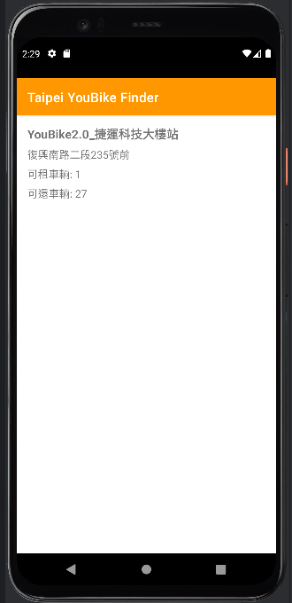

# Taipei YouBike Finder

## 概述
台北 YouBike 查找器是一款安卓應用程式，旨在幫助用戶查找台北的 YouBike 站點。該應用程式顯示所有 YouBike 站點的列表，允許用戶搜索特定站點，並提供每個站點的詳細資訊，如可用自行車數量和可還車位數量。用戶還可以新增新的站點並查看附近的站點。

## 資料來源
應用的數據來自於台北市政府的 YouBike 2.0 即時資料接口：
[YouBike 2.0 即時資料](https://tcgbusfs.blob.core.windows.net/dotapp/youbike/v2/youbike_immediate.json)

## 功能
- 顯示所有 YouBike 站點的列表。
- 按名稱搜索特定站點。
- 查看每個站點的詳細資訊。
- 新增新的站點。
- 查看 1 公里半徑內的附近站點。
- 撤銷站點刪除操作。

## 權限
該應用程式需要以下權限：
- INTERNET：用於從 YouBike API 獲取站點資料。
- ACCESS_FINE_LOCATION：用於訪問用戶的位置以顯示附近的站點。
- ACCESS_COARSE_LOCATION：用於粗略位置訪問。

## 如何執行
1. 複製此專案到本地：

    ```sh
    git clone https://github.com/111b13929/TaipeiYouBikeFinder_Plus.git
    ```

2. 開啟 Android Studio，並選擇「Open an existing Android Studio project」，導入此專案。

3. 確保您已經連接到網路，並配置好 Android 模擬器或連接了 Android 設備。

4. 執行應用。

在最低 SDK 版本為 29 的安卓設備或模擬器上構建並運行應用程式。

## 使用
- 獲取站點資料：應用程式啟動時從 YouBike API 獲取站點資料，並在使用者向下滑動列表時刷新資料。
- 搜索站點：使用螢幕頂部的搜索欄按名稱搜索特定站點。
- 查看詳情：點擊列表中的站點以查看其詳細資訊。
- 新增新站點：使用導航抽屜選擇“新增站點”。填寫站點詳細資訊並點擊“新增”。
- 查看附近站點：使用導航抽屜選擇“顯示附近站點”。應用程式將顯示使用者位置 1 公里半徑內的站點。
- 撤銷刪除：如果誤刪了站點，使用導航抽屜選擇“撤銷”以恢復最後刪除的站點。

## 程式碼結構
- MainActivity.java：顯示站點列表並處理使用者互動的主要活動。
- DetailActivity.java：顯示所選站點詳細資訊的活動。
- YouBikeAdapter.java：用於在 RecyclerView 中顯示站點列表的適配器。
- YouBikeService.java：用於從 YouBike API 獲取站點資料的 Retrofit 介面。
- YouBikeStation.java：YouBike 站點的資料模型類。
- RetrofitClient.java：配置 Retrofit 客戶端。

## 依賴項
該專案使用以下依賴項：

```groovy
dependencies {
    implementation 'androidx.appcompat:appcompat:1.7.0'
    implementation 'com.google.android.material:material:1.12.0'
    implementation 'androidx.constraintlayout:constraintlayout:2.1.4'
    testImplementation 'junit:junit:4.13.2'
    androidTestImplementation 'androidx.test.ext:junit:1.1.5'
    androidTestImplementation 'androidx.test.espresso:espresso-core:3.5.1'
    implementation 'androidx.recyclerview:recyclerview:1.3.2'
    implementation 'com.squareup.retrofit2:retrofit:2.9.0'
    implementation 'com.squareup.retrofit2:converter-gson:2.9.0'
    implementation 'com.squareup.okhttp3:logging-interceptor:4.9.1'
    implementation 'androidx.swiperefreshlayout:swiperefreshlayout:1.1.0'
    implementation 'com.google.android.gms:play-services-maps:18.0.2'
    implementation 'com.google.android.gms:play-services-location:21.0.1'
}

## 執行結果畫面
主界面顯示所有 YouBike 站點的列表：


點選某個站點顯示詳細資訊：


搜索站點：


新增新站點：


刪除站點：


查看附近站點：


撤銷刪除：

如有任何問題或反饋，請聯繫專案維護者：[111B13929@gmail.com 或 erl1235509@gmail.com]。
